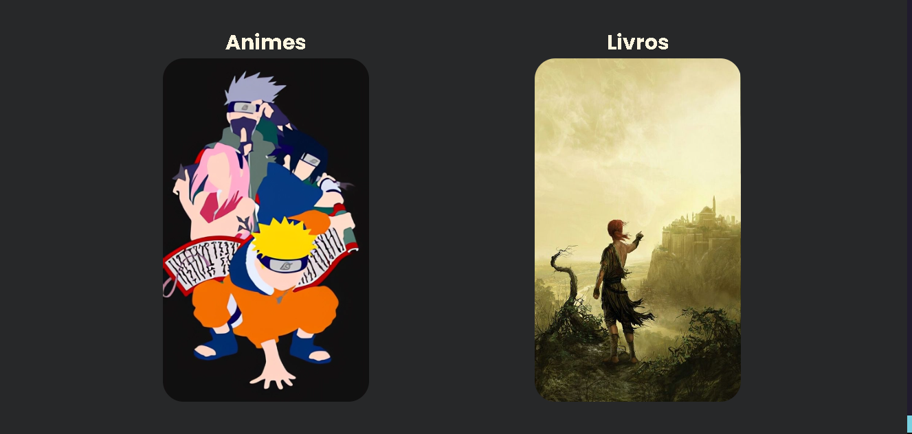
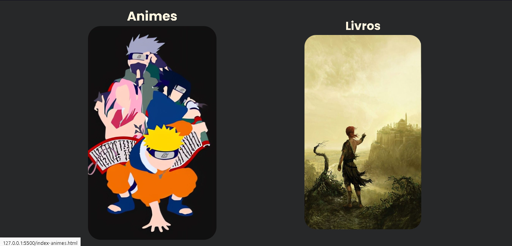
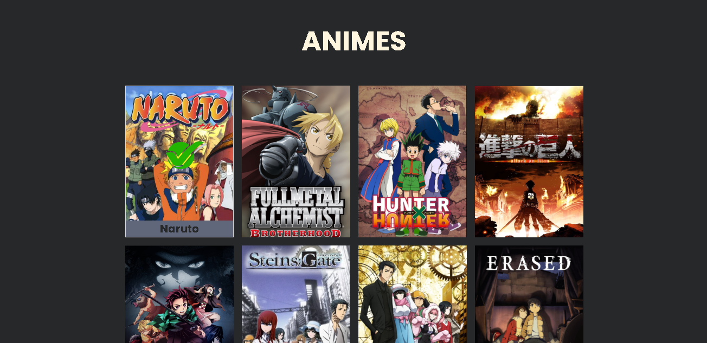
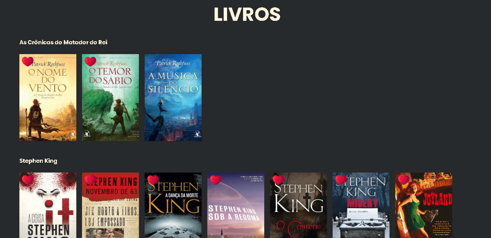
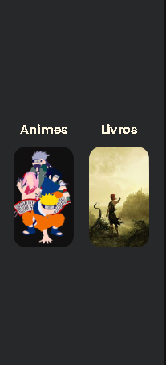
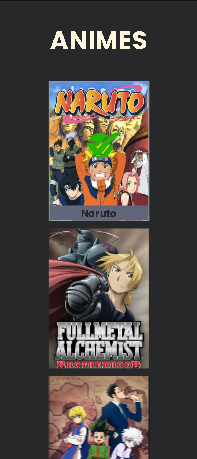
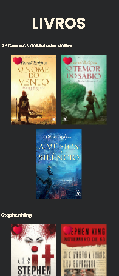

# Animes e Livros
Desenvolvi um site destinado a catalogar meus animes e livros. Foi a primeira vez que trabalhei individualmente com animações em CSS e também a minha estreia com JavaScript. Utilizei a animação CSS para exibir uma imagem de carregamento dos animes que ainda não completei, enquanto o JavaScript foi empregado para criar animações ao rolar as páginas, fazendo uso da biblioteca Scroll Reveal. 😎

## Versão Desktop:

[]

[]

[]

[]

[]

## Versão Celular:

[]

[]

[]

[]

## Tecnologias utilizadas
- HTML
- CSS
- JavaScript

